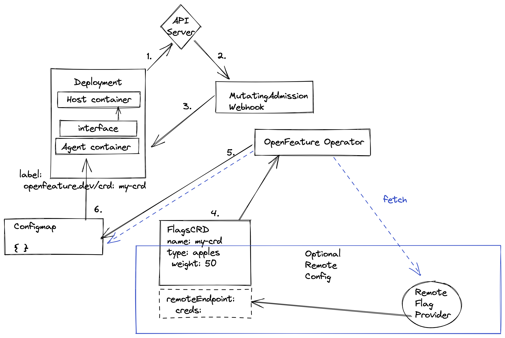

## open-feature-operator

### Project structure

```
├── Dockerfile
├── Makefile
├── PROJECT
├── README.md
├── agent ( Contains the agent that is injected by Mutating admission webhook)
├── api ( Custom Resource definitions )
├── bin
├── config
├── controllers
├── examples ( Example of how to use the operator )
├── go.mod
├── go.sum
├── hack
├── main.go
└── webhooks ( Mutating admission webhooks to insert the sidecar )
```

#### Architecture

As per the issue [here](https://github.com/open-feature/research/issues/1)
High level architecture is as follows:

